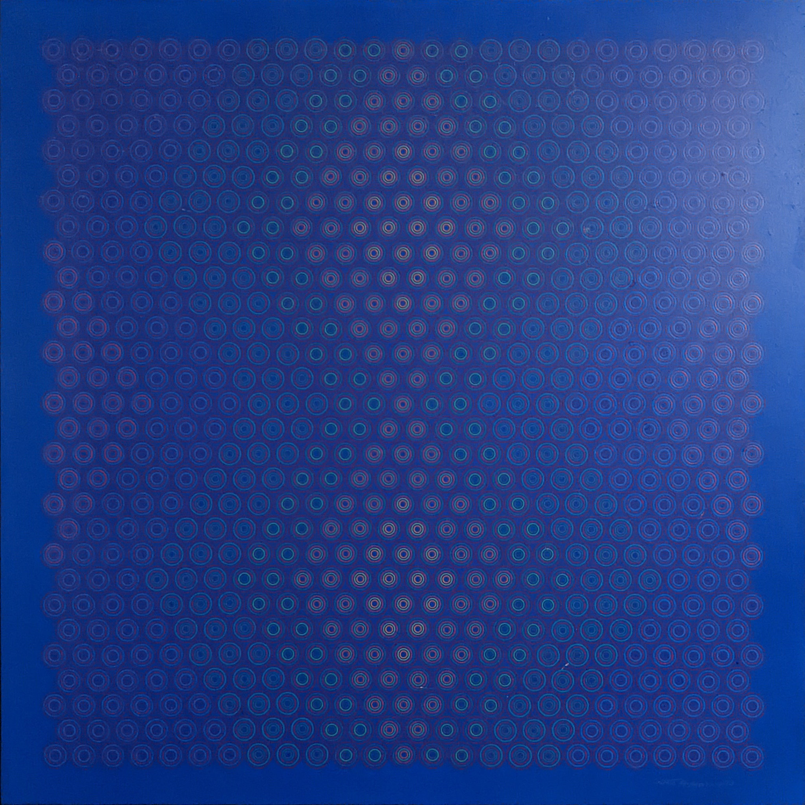

# Generative Art 2

## Beginning of Exploration

Inspired by art on vacation, 25 or 24 circles across and 29 rows.

Learned a lot along the way on making code that's malleable with a repeating pattern.

A little meta art is the way the code in the `color` function has rhythm in its own right.

Settled down on a start from the top and have "rows" with which columns should get which color.

We only write out 8 rows since the others are repeats of those "first 8" so really it visually repeats every 14 rows. Similar cheats weren't clear for columns so those are all writtend down (sparsely) for the 24 column pattern.

While writing the code a debug set of colors for `colorSequences` was used to help clearly see what was going on vs. the subtle ones in there at the end.

## Maybe Continuations

I did a little exploration on much wider / longer sets of circles and also considered moving towards a pattern more similar to the exploration with the outer corners not really in the pattern.

Experimenting with some more circle color choices that share amongst nearby pattern neighbors while being less hand picked is another path for a potential future.

This was really fun for a rigid repeat without any complexity either from randomness or inherent in the rules of creation. Figuring out a cellular automata approach to how to vary the pattern may be a next step on having this be less hand coded and more rules generations based.

### Build / Deploy / Formatting

Just run a local webserver like `python3 -m http.server 1002` and go to:

http://localhost:1002/

Hit refresh on the page after saving any file.

Available out on github pages at:

https://solenoid.github.io/generative-art-2/

Formatting is just using prettier locally with no config so apparently saying good-bye to semi-colons;
